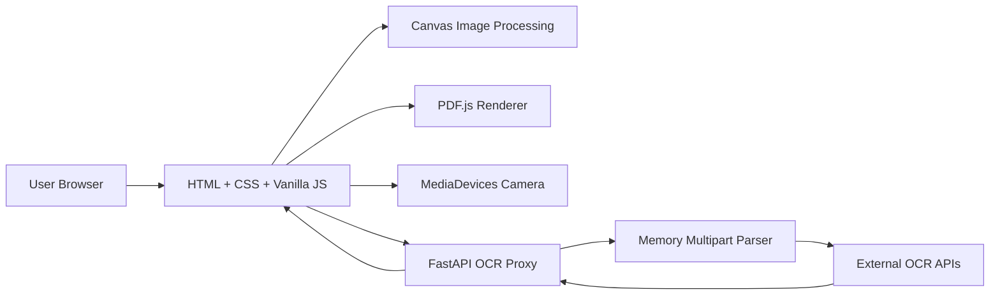
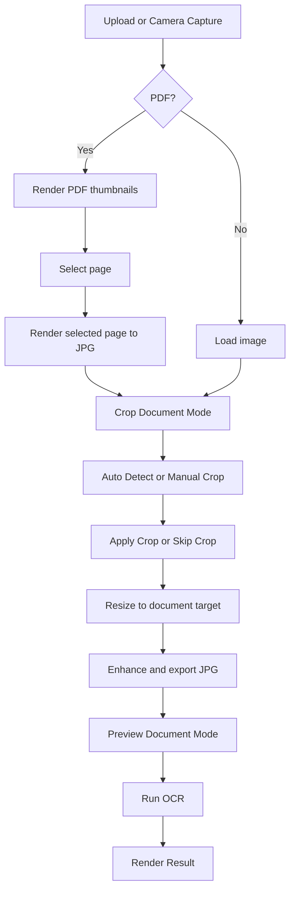
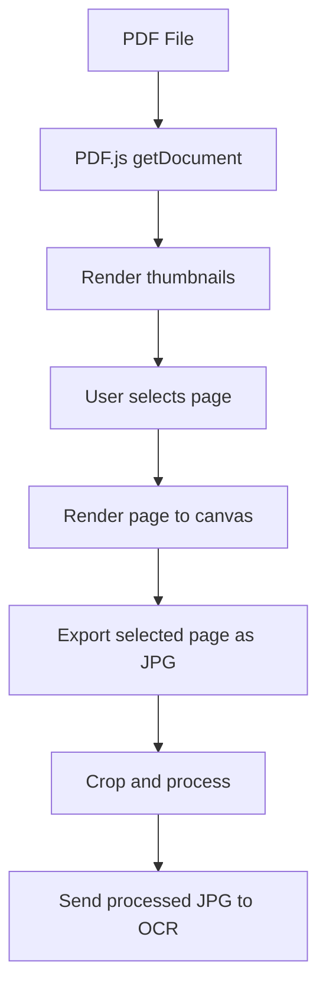
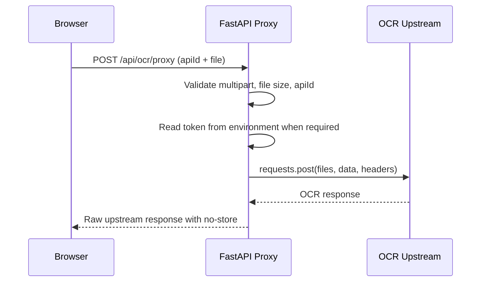
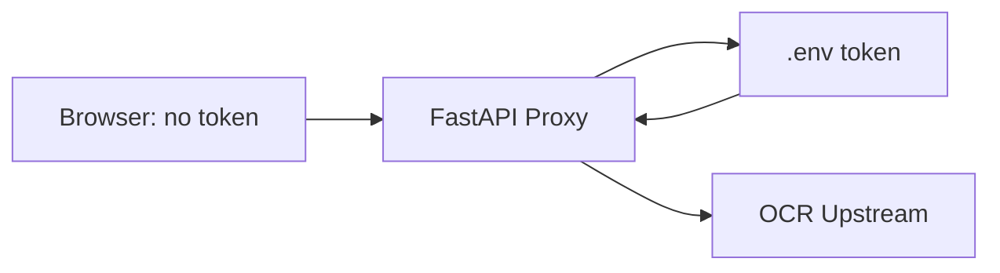

# OCRCDG Tech Stack And Architecture

เอกสารนี้อธิบาย stack, flow, security boundary และเหตุผลเชิงเทคนิคของ OCRCDG

## System Overview



OCRCDG ใช้ frontend แบบ framework-free เพื่อให้ deploy ง่ายและควบคุม lifecycle ของไฟล์ได้ชัดเจน ส่วน backend ใช้ FastAPI ทำหน้าที่เป็น static server และ OCR proxy ที่เก็บ token ไว้ฝั่ง server เท่านั้น

## Technology Stack

| Layer | Technology | Purpose |
|---|---|---|
| UI Structure | HTML5 | Home, Camera, Workspace, Crop, Preview, Result |
| Styling | CSS3 | Responsive layout, camera frame, panels, toolbar, output views |
| Frontend Logic | Vanilla JavaScript | State management, file flow, camera, crop, OCR request |
| Image Processing | Canvas API | Crop, resize, white padding, enhancement, JPG export |
| Camera | MediaDevices API | Open camera with `getUserMedia()` |
| PDF Rendering | PDF.js CDN | Render PDF thumbnails and selected page images in browser |
| Encoded Payload Decode | pako CDN + browser APIs | Optional zlib/base64 image preview support |
| HTTP Client | Fetch API | Browser to FastAPI proxy |
| Backend Framework | FastAPI `0.115.6` | API routes, JSON responses, static file serving |
| ASGI Server | Uvicorn `0.32.1` | Local HTTP server |
| Multipart Parsing | `email.parser.BytesParser` | Memory-only multipart parser without writing uploads to disk |
| Upstream HTTP | requests `2.32.5` | Server-side call to external OCR APIs |
| Config | `.env` + `os.environ` | Runtime host, port, base URL, and auth token |

## File Responsibilities

| File | Responsibility |
|---|---|
| `index.html` | Application markup and page containers |
| `styles.css` | Visual design, responsive layout, camera overlays, output panels |
| `app.js` | Frontend state, file preparation, OCR flow, cleanup, rendering |
| `server.py` | FastAPI app, static file routes, OCR status and proxy endpoints |
| `requirements.txt` | Python dependencies |
| `.env.example` | Example server-side environment variables |
| `.gitignore` | Prevents local secrets, virtual envs, and caches from being committed |
| `README.md` | User-facing setup and usage guide |
| `TECH_STACK.md` | Technical architecture guide |

## Frontend Architecture

The frontend is a single-page application built with plain JavaScript. It uses one central `state` object and renders sections based on the current page and workspace mode.

Core UI modes:

| Mode | Purpose |
|---|---|
| `home` | Upload file or open camera |
| `camera` | Capture a document image from camera |
| `workspace: pdf-pages` | Select PDF page before OCR |
| `workspace: crop` | Detect and adjust document crop area |
| `workspace: preview` | Inspect processed image and run OCR |
| `workspace: result` | Review plaintext, JSON, image preview, and encoded payloads |

Important state fields:

| State | Description |
|---|---|
| `originalFile` | File selected by upload or generated by camera |
| `processedFile` | Image after crop, resize, and enhancement |
| `pdfDocument` | PDF.js document instance |
| `selectedPdfPageImageFile` | Rendered JPG for the chosen PDF page |
| `processedPdfPageFile` | Processed JPG for OCR when using PDF mode |
| `cropBox` | Current crop rectangle in natural image coordinates |
| `previewView` | Zoom and pan data for preview mode |
| `ocrResult` | Normalized OCR result for UI rendering |
| `controller` | AbortController for pending OCR requests |
| `encodedPayloads` | Full base64/encoded strings collected from OCR JSON |

## Document Processing Flow



### Target Output Sizes

The frontend standardizes images before OCR to reduce upstream variance.

| Document Type | Width | Height | Notes |
|---|---:|---:|---|
| ID Card | `1000` | `630` | Used for front/back ID card APIs |
| Passport | `1000` | `700` | Used for passport APIs |
| A4 Portrait | `1240` | `1754` | Used for portrait documents |
| A4 Landscape | `1754` | `1240` | Used for landscape documents |

The resize logic keeps the image aspect ratio, draws on a white target canvas, and avoids stretching the document.

## Camera Flow

The camera page uses `navigator.mediaDevices.getUserMedia()` with an environment-facing camera preference:

```js
{
  audio: false,
  video: {
    facingMode: { ideal: "environment" },
    width: { ideal: 1920 },
    height: { ideal: 1080 }
  }
}
```

Capture pipeline:


Camera presets:

| Preset | CSS Frame Class | Target |
|---|---|---|
| `idCard` | `.id-card` | `1000 x 630` |
| `passport` | `.passport` | `1000 x 700` |
| `a4Portrait` | `.a4-portrait` | `1240 x 1754` |
| `a4Landscape` | `.a4-landscape` | `1754 x 1240` |

After capture, the camera stream is stopped immediately.

## PDF Flow

PDF files are processed in the browser. The original PDF is not sent directly to OCR.



This keeps upstream OCR behavior predictable because the proxy receives an image file rather than a multi-page PDF.

## OCR Result Handling

The OCR response is kept as raw JSON and also normalized for display.

Result rendering includes:

| Output | Behavior |
|---|---|
| Plaintext | Human-readable key/value output |
| JSON | Pretty-printed response with long encoded payloads shortened inline |
| OCR Image Preview | Decodes image payloads when possible |
| Encoded Payloads | Dropdown/expand panel for full base64 or compressed payload strings |
| Download | Export text or JSON result |

Long base64 values are not removed. They are shortened in the JSON area to avoid hiding important OCR fields, while full values remain available in the Encoded Payloads panel.

## Backend Architecture

FastAPI exposes three main route groups.

| Route | Method | Purpose |
|---|---|---|
| `/` | GET | Serve `index.html` |
| `/index.html` | GET | Serve static HTML |
| `/styles.css` | GET | Serve CSS |
| `/app.js` | GET | Serve frontend JavaScript |
| `/api/ocr/status` | GET | Report which APIs require auth and whether auth is configured |
| `/api/ocr/proxy` | POST | Receive browser multipart upload and forward to OCR upstream |

All static and API responses include:

```text
Cache-Control: no-store
```

### Proxy Flow



### Multipart Parser

The backend does not depend on `python-multipart`. It reads the request body and parses multipart data in memory with Python standard library APIs:

```py
from email.parser import BytesParser
```

This keeps the dependency list small and avoids temporary upload files.

## Backend Validation

| Check | Behavior |
|---|---|
| Content-Type | Must start with `multipart/form-data;` |
| Upload size | Max `20 MB` |
| API ID | Must match server-side `PROXY_APIS` |
| Auth token | Required for APIs with `auth_env_key` |
| Upstream timeout | `45` seconds |

HTTP error mapping:

| Status | Meaning |
|---:|---|
| `400` | Invalid request, unsupported API, or missing file |
| `413` | Upload larger than `20 MB` |
| `502` | Cannot connect to OCR upstream |
| `503` | Required server token is missing |
| `504` | OCR upstream timeout |

## OCR API Mapping

| API ID | Endpoint | Multipart Key | Extra Fields | Auth |
|---|---|---|---|---|
| `front-id` | `${WEBSOLUTION_BASE_URL}/ocr/id` | `image_file[]` | - | - |
| `front-id-custom` | `${WEBSOLUTION_BASE_URL}/ocrmid/` | `image_file[]` | `type=id` | - |
| `front-id-other` | `https://facepoc.cdgs.co.th/ocr/api/v1/upload_front_file` | `file` | - | `OCR_OTHER_AUTH_TOKEN` |
| `back-id` | `${WEBSOLUTION_BASE_URL}/ocr/back_id` | `image_file[]` | - | - |
| `back-id-custom` | `${WEBSOLUTION_BASE_URL}/ocrmid/` | `image_file[]` | `type=backid` | - |
| `back-id-other` | `https://facepoc.cdgs.co.th/ocr/api/v1/upload_back_file` | `file` | - | `OCR_OTHER_AUTH_TOKEN` |
| `passport` | `${WEBSOLUTION_BASE_URL}/ocr/passport` | `image_file[]` | - | - |
| `passport-custom` | `${WEBSOLUTION_BASE_URL}/ocrmid/` | `image_file[]` | `type=passport` | - |
| `custom-document` | `${WEBSOLUTION_BASE_URL}/ocr/custom` | `image_file[]` | - | - |

## Privacy Cleanup Design

Sensitive state is cleared automatically when:

- A new file is selected
- `New Image` is clicked
- User returns Home
- Browser page is closed or refreshed
- PDF page/document changes
- OCR session is cancelled or ends
- Auto-clear timer expires after OCR result

Cleanup actions include:

- Revoke all Object URLs
- Clear `originalFile`, `processedFile`, `pdfDocument`, `ocrResult`
- Clear canvas
- Clear image `src` and PDF object data
- Stop camera stream
- Abort pending OCR request
- Reset file input
- Hide result image preview
- Clear encoded payload state

## Security Boundary



Security principles:

- Tokens live only in `.env`
- `.env` is ignored by Git
- Browser sends only `apiId` and file content
- Authorization headers are created server-side
- Debug data masks token values
- No database or persistent OCR result storage is used

## Known Limitations

- PDF OCR is page-by-page, not batch all pages
- TIFF preview depends on browser support
- Auto crop is heuristic and should be reviewed by the user
- PDF.js and pako are loaded from CDN
- The app is designed for local/internal usage unless additional production hardening is added

## Production Hardening Ideas

- Serve PDF.js and pako locally instead of CDN
- Add authentication in front of the app
- Add structured audit logs without sensitive payloads
- Add rate limits and request IDs
- Add automated browser tests for camera/crop flows
- Add CI checks for Python compile and JavaScript syntax
